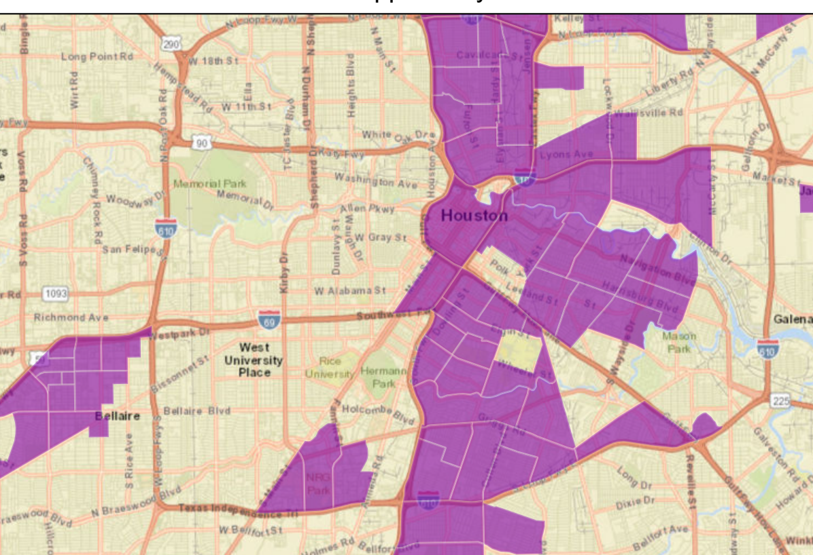

<!--
_class: blue
_paginate: false
_backgroundImage: "radial-gradient(circle farthest-corner at 34% 52%,rgba(114,184,227,.88),rgba(0,145,234,.92) 50%,rgba(17,47,110,.95)),url(https://uploads-ssl.webflow.com/593c5902e5608a435f48c620/59e90ec930dfca0001a844e5_banner%20Bioventures%202017%20and%20alums.jpg)"
-->

###### enventure.

---
<!-- _class: left -->

###### enventure 3.0

*investing in community*

**Initial Strategy**
Will Clifton, MD
* Co-founder // Enventure
* Director of Medical Innovation // Rice University

---

###### neigh·bor·hood

/ˈnābərˌho͝od/
a district forming a community within a town or city
:heart:

---

# vision
intentional
collaborative
affordable
community-
-living and -working
for healthcare

---
<!-- _class: blue -->

<!--_backgroundImage: "radial-gradient(circle farthest-corner at 34% 52%,rgba(114,184,227,.88),rgba(0,145,234,.92) 50%,rgba(17,47,110,.95)),url(https://scontent-dfw5-1.cdninstagram.com/v/t51.2885-15/e35/54222471_121615962327925_1234660719474861556_n.jpg?_nc_ht=scontent-dfw5-1.cdninstagram.com&_nc_cat=101&_nc_ohc=WFnGTHotgdsAX9j8103&oh=6ae61af79ca653fd86e106a56089c5ce&oe=5EB06D4D)"-->

# example

---

# problem

need grad student housing

---

<!-- _class: blue -->

# solution

* <2 mi from TMC
* estimated 15 anchor tenants + 16 grad students
* \>51% low income
* recruiting from grad student housing services and RA communities
* co-op structure?
* est. $10M development
* event space, networking

---

# unique

because

---

# traction

* customers
* developers
* investors

---

# incentives

* [opportunity zones](https://www.houstontx.gov/opportunityzones/index.html) - deferred capital gains tax encourages investment
    <!--1) Tax deferral for capital gain invested in a qualified Opportunity Zone fund
    2) Elimination of up to 15% of the tax on capital gains invested in the qualified Opportunity Zone fund
    3) Potential elimination of tax when exiting a qualified opportunity fund investment-->
* [low-income housing tax credit](https://www.tdhca.state.tx.us/multifamily/index.htm) - 4-9% income tax credit
* [multifamily direct loan program](https://www.tdhca.state.tx.us/multifamily/home/index.htm) - low interest construction loans

<!-- 9% program preference for non-profits-->

---

---

# plan

* ~$10M
* 5 acres

---

# next steps / asks

1) estimate project budget w/ nextseed
2) determine amount each party needs to bring to the table
3) identify +/- purchase land
4) apply for opportunity zone project

<!--https://marketplace.visualstudio.com/items?itemName=marp-team.marp-vscode
    https://spec.commonmark.org/0.29/>
    https://marpit.marp.app/>
    https://mermaid-js.github.io/mermaid/#/flowchart
    https://commonmark.org/help/
-->
